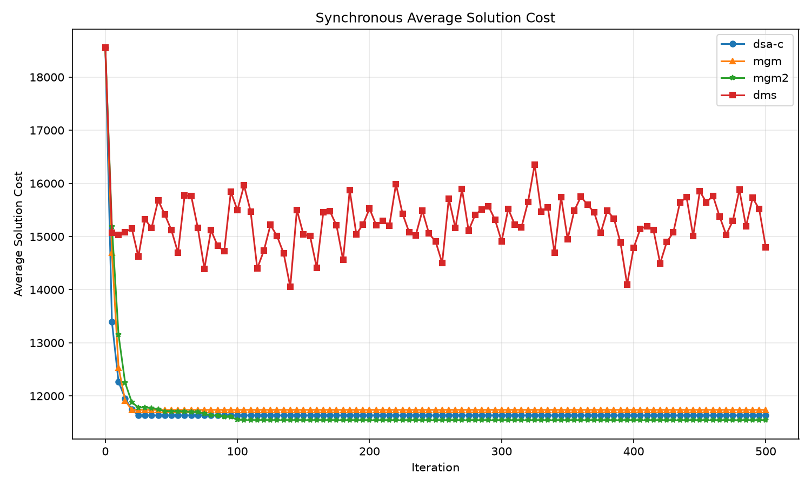
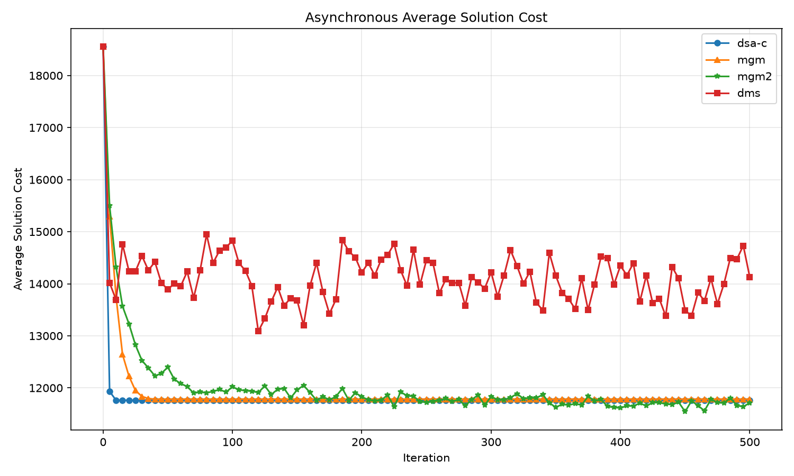
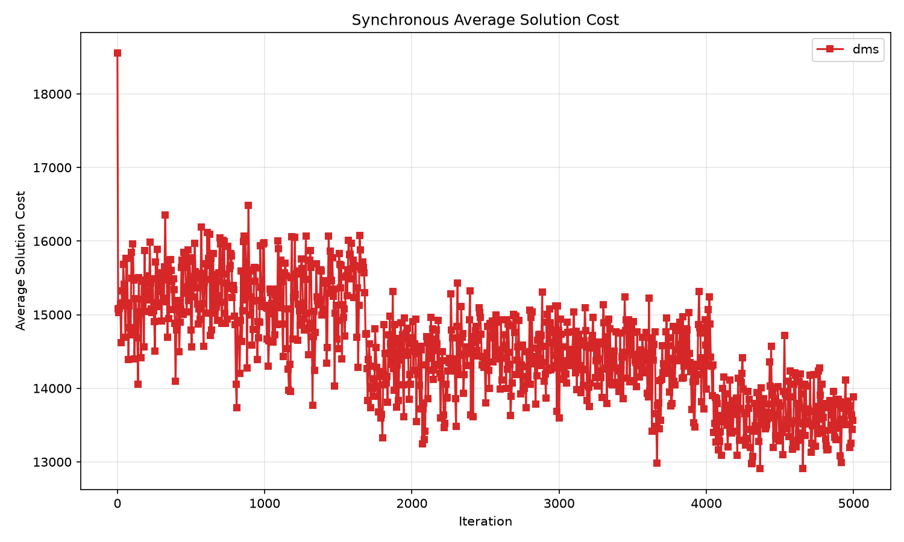
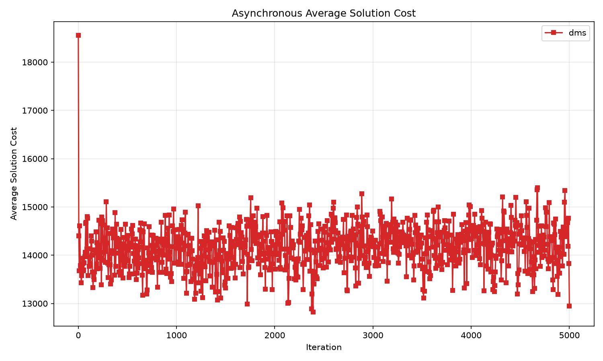
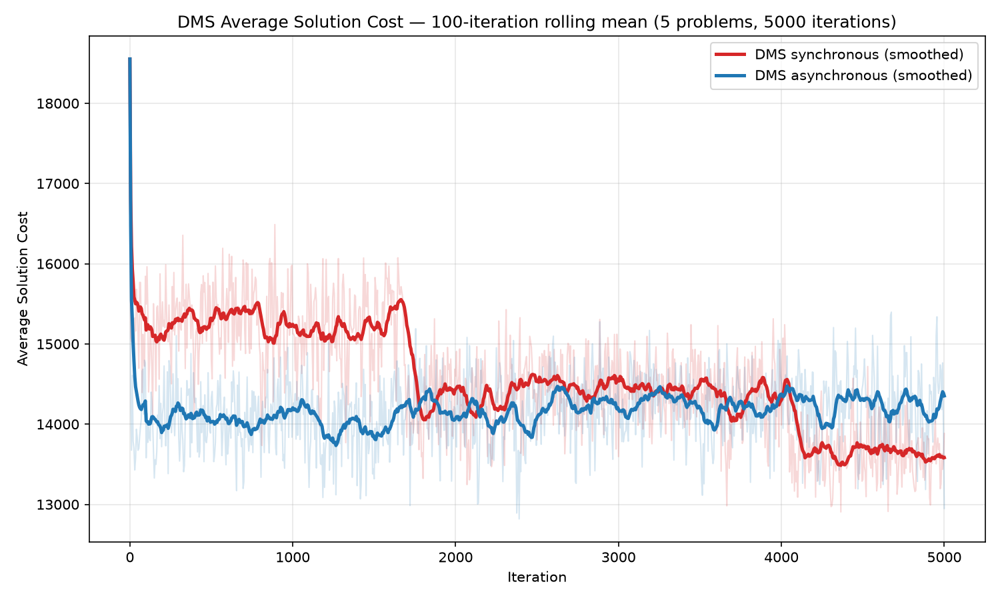
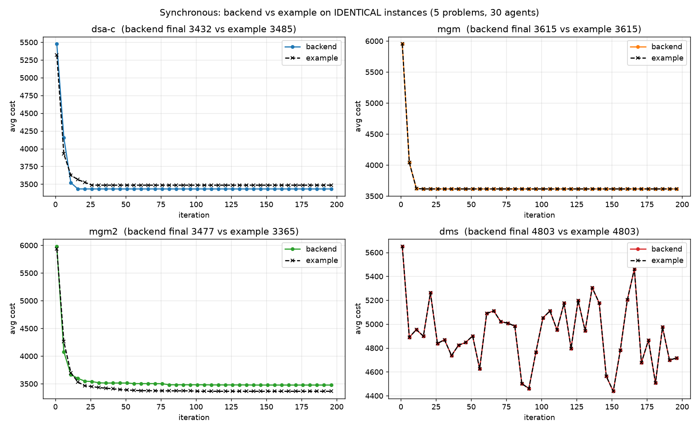
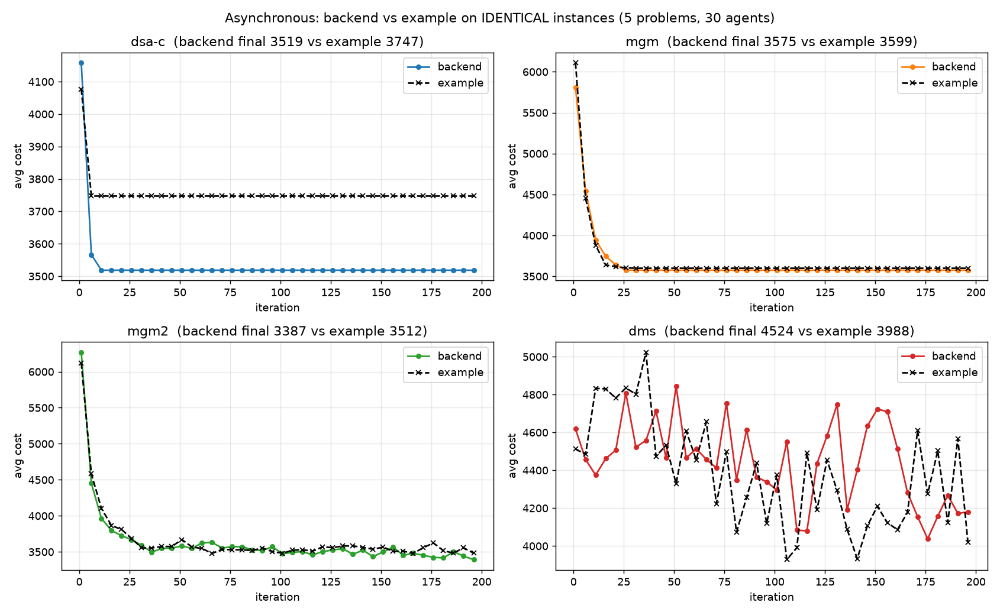

# IIoT Assignment 2 — Distributed Constraint Optimization: A Research Analysis

This repository implements and compares four **incomplete distributed algorithms**
for solving randomly generated **Distributed Constraint Optimization Problems
(DCOPs)**, under both a **synchronous** and an **asynchronous** execution model.

This document is a self-contained research write-up: it defines the problem,
explains *how and why* each algorithm works, presents the experimental results as
graphs, analyses each graph, and explains *why we see the behaviour we see*. It
also validates the implementation against a reference implementation on identical
problem instances.

> **TL;DR.** The three *local-search* algorithms (DSA‑C, MGM, MGM‑2) converge
> within ~30 iterations to a good local optimum (≈ 35–37 % cost reduction at 50
> agents). The *inference* algorithm (DMS / damped min‑sum) **oscillates for the
> entire run and never settles** — because the random DCOP factor graphs are
> densely cyclic, where belief propagation has no convergence guarantee. Crucially,
> DMS's *best-seen* assignment is competitive (≈ 36–39 %); it simply drifts away
> from it. On identical instances our backend matches the reference implementation
> (MGM and DMS bit‑for‑bit; DSA‑C and MGM‑2 within stochastic noise).

---

## 1. The DCOP problem

A **DCOP** is defined by:

- A set of **agents** `0..N-1`, each owning exactly one **variable**.
- A finite **domain** `{0, 1, …, D-1}` of values each variable can take.
- A set of **binary constraints**. A constraint between agents *i* and *j* is a
  `D×D` integer **cost matrix** `C_ij`, where `C_ij[a][b]` is the cost incurred
  when agent *i* picks value *a* and agent *j* picks value *b*.

The **global cost** of an assignment is the sum of the costs of every constraint,
counted once per edge:

```
cost(assignment) = Σ over edges (i,j)  C_ij[ assignment[i] ][ assignment[j] ]
```

The goal is to **minimise** the global cost. **Lower is better.**

### A tiny worked example

Two agents `A`, `B`, domain `{0,1}`, one constraint:

```
          B=0   B=1
   A=0  [   5  ,  2  ]
   A=1  [   8  ,  1  ]
```

- Assignment `A=0, B=0` → cost `5`.
- Assignment `A=0, B=1` → cost `2`.
- Assignment `A=1, B=1` → cost `1`  ← optimal here.

With one binary constraint this is trivial; with 50 agents and a dense web of
conflicting constraints, finding the global optimum is **NP‑hard**, which is why
we use *incomplete* algorithms that find good solutions quickly rather than
provably optimal ones.

---

## 2. Experimental setup

Problems are generated randomly and reproducibly (`backend/dcop/generator.py`):
an Erdős–Rényi graph where each pair of agents shares a constraint with
probability `p`, and every constraint gets a random `D×D` cost matrix with entries
in `[1, max_cost]`. The same generated problems (and the same initial assignment)
are reused across all algorithms and both simulators, so comparisons are fair.

The graphs in this report come from the **full simulation run**:

| Parameter | Value |
|---|---|
| Problems (averaged) | 50 |
| Agents | 50 |
| Domain size | 10 |
| Constraint probability `p` | 0.30 (≈ 367 edges, mean degree ≈ 15) |
| Constraint cost range | 1 – 100 |
| Iterations / async steps | 1000 |
| DSA‑C move probability | 0.70 |
| DMS damping λ | 0.90 |
| Mean initial cost | 18,447 |

Each curve is the **average global cost over the 50 problems** at each iteration.

---

## 3. The four algorithms

### 3.1 DSA‑C — Distributed Stochastic Algorithm (variant C)

**How it works.** Every iteration, *all* agents act simultaneously. Each agent
looks at its neighbours' latest values, computes the value that minimises its own
local cost, and — **with probability `p = 0.70`** — switches to it. Variant **C**
accepts a move when the new local cost is *less than or equal* to the current one
(it allows equal‑cost "plateau" moves), which distinguishes it from variant A
(strict improvement only).

**Why it works.** It is parallel randomised hill‑climbing. The probability `p` is
the crucial ingredient: if every agent always moved greedily and simultaneously,
two neighbours would react to each other's *stale* values and overshoot, causing
oscillation. Moving only with probability `p` decorrelates neighbours and lets the
system settle. Equal‑cost moves let it drift across plateaus and escape shallow
traps.

**What to expect.** A fast drop to a local optimum, then a flat plateau. Cheap per
iteration; only value messages are exchanged.

### 3.2 MGM — Maximum Gain Messages

**How it works.** Two phases per iteration. (1) Each agent computes its **gain**
(how much it could reduce its local cost by moving) and sends it to its
neighbours. (2) An agent actually moves **only if its gain is strictly the largest
in its neighbourhood** (ties broken by lower agent id).

**Why it works.** Because two neighbours can never move in the same round, the
global cost is **monotonically non‑increasing** — MGM never thrashes. It provably
converges to a **1‑opt local optimum** (no single agent can improve). It is
deterministic.

**What to expect.** A smooth, monotone descent to a plateau, often reached in very
few iterations. Its weakness is that it gets stuck at the first 1‑opt optimum.

### 3.3 MGM‑2 — coordinated pair moves

**How it works.** Extends MGM with **2‑opt** moves. With probability 0.5 an agent
*offers* to a random neighbour; the receiver evaluates the best *joint* move for
the pair and accepts/rejects (propose → accept/reject handshake). Pairs and
unpaired singletons then compete by gain (ties broken by the lower group leader),
and the locally‑dominant improving groups commit together.

**Why it works.** Some local optima trap any single‑agent (1‑opt) algorithm: no
agent can improve alone, but a *pair* changing together can. By coordinating pair
moves, MGM‑2 escapes a class of optima that MGM and DSA‑C cannot, so it can reach
a (slightly) lower cost — at the price of the most communication (the handshake).

**What to expect.** Fast descent like MGM, to the **lowest plateau** of the four,
but with the **most messages**.

### 3.4 DMS — Max‑Sum with damping (implemented as Min‑Sum)

**How it works.** A belief‑propagation / inference method on the **factor graph**
(variable nodes + one factor node per constraint). Two message types flow along
each edge: variable→factor (`Q`) and factor→variable (`R`). Messages are vectors
over the domain; `R` is computed by minimising the constraint cost plus the
incoming `Q` (min‑sum). **Damping** (`λ = 0.9`) blends each new message with the
previous one to suppress oscillation. Each agent forms a **belief** = sum of
incoming `R` messages and picks the value with minimum belief.

**Why it works — and why it struggles here.** On a **tree‑structured** factor
graph, max‑sum computes the exact optimum. But random DCOPs at `p = 0.30` are
**densely cyclic ("loopy")**, and on loopy graphs min‑/max‑sum has **no
convergence guarantee**: messages circulate around cycles, beliefs oscillate, and
the decoded assignment keeps changing. Damping reduces but does not eliminate
this. The result is a **noisy cost curve that never settles**.

**What to expect.** A jagged, oscillating curve sitting well above the
local‑search trio.

---

## 4. The two simulators

**Synchronous** (`backend/simulators/synchronous.py`). Global rounds with
barriers: every agent reads a consistent snapshot, all act, the round advances.
Deterministic for a given seed → smooth, repeatable curves. The x‑axis is the
iteration number.

**Asynchronous** (`backend/simulators/asynchronous.py`). One **thread + mailbox
per agent**; each agent owns its state and acts whenever it has received at least
one message, using the **latest** message from every neighbour (an `agent_view`).
There is no global clock, so progress is measured by a **Lamport‑style minimum
local step** across all agents, and a run stops when the slowest agent reaches the
step limit. Because thread scheduling is non‑deterministic, async curves are
**noisier** than sync, even though final quality is comparable.

---

## 5. Results — synchronous



**What the graph shows.** The three local‑search algorithms (blue = DSA‑C ●,
orange = MGM ▲, green = MGM‑2 ★) collapse from 18,447 to ≈ 11,700–12,000 within
**~30 iterations** and then stay essentially flat for the remaining ~970
iterations. DMS (red ■) drops less and **oscillates around ~14,800–15,700 for the
entire run** — it never converges.

**Average results over the 50 problems (synchronous, 1000 iterations):**

| algorithm | final cost | drop | best‑seen | messages | runtime |
|---|--:|--:|--:|--:|--:|
| dsa‑c | 11,797 | 36.0 % | 11,797 | 731,400 | 10.6 min |
| mgm   | 11,991 | 35.0 % | 11,991 | 1,462,800 | 10.6 min |
| mgm2  | 11,714 | **36.5 %** | 11,714 | 2,194,200 | 22.5 min |
| dms   | 15,137 | 17.9 % | **11,729 (36.4 %)** | 1,462,800 | 324.6 min |

**Why we see this.**

- **Local search wins on these instances.** DSA‑C / MGM / MGM‑2 exploit locality
  and reach a good 1‑opt/2‑opt optimum within ~30 iterations; the remaining
  iterations add nothing. MGM‑2 reaches the lowest plateau because its pair moves
  escape optima the single‑agent methods cannot.
- **DMS oscillates and never settles** — the loopy‑graph behaviour of §3.4. But
  its *best‑seen* cost (11,729, a 36.4 % reduction) is on par with local search:
  DMS *does* find good assignments, it just drifts away from them (see §7).
- **Communication cost** scales with the message pattern: DSA‑C sends one value
  message per neighbour (cheapest), MGM adds gains (2×), DMS exchanges Q/R vectors,
  and MGM‑2's propose/accept handshake is the most expensive (3×). Because the
  synchronous simulator runs the full iteration count (no early stop), these scale
  linearly with iterations.
- **Runtime** is dominated by the synchronous DMS (**324.6 min ≈ 5.4 h** of the
  ~6.5 h total). It is the only pure‑Python algorithm; the async DMS (and the
  reference) are numpy‑vectorised and ~30× faster. Vectorising the sync DMS would
  bring the whole run to ~1.5 h — see §11.

---

## 6. Results — asynchronous



**Average results over the 50 problems (asynchronous, 1000 steps):**

| algorithm | final cost | drop | best‑seen | runtime |
|---|--:|--:|--:|--:|
| dsa‑c | 11,928 | 35.3 % | 11,928 | 3.8 min |
| mgm   | 12,022 | 34.8 % | 12,022 | 2.4 min |
| mgm2  | 11,647 | 36.9 % | 11,358 (38.4 %) | 3.4 min |
| dms   | 13,906 | 24.6 % | **11,310 (38.7 %)** | 11.4 min |

**Why we see this.** The qualitative picture matches the synchronous case — local
search converges fast and low, DMS oscillates high — confirming the behaviour is a
property of the *algorithms*, not the execution model. The async curves are
**jaggier**, because each agent acts on whatever messages have arrived so far (not
a clean global snapshot) and thread timing varies run to run. DMS is the noisiest
of all, yet its *best‑seen* assignment (11,310, **38.7 % — the lowest cost reached
by any method in the whole study**) again shows that DMS's poor *final* number is
an artefact of its oscillation, not of solution quality.

> **Engineering note.** Reaching this required rewriting the async simulator to a
> true per‑agent‑thread design (each agent owns its state; no global lock). An
> earlier event‑driven design that re‑decided on *every* message made local search
> thrash to a much worse solution (~15 % drop) and could livelock MGM‑2.

---

## 7. Why DMS oscillates (the key insight)

It is tempting to read the graphs as "DMS is a worse algorithm," but the precise
statement is: **min‑sum is exact on trees and unreliable on dense cyclic graphs.**
Our random DCOPs at `p = 0.30` have ~367 edges over 50 nodes — far from a tree,
full of short cycles. Messages propagate around those cycles and reinforce
themselves, so beliefs oscillate instead of fixing a consistent optimum. Damping
(`λ = 0.9`) is exactly the standard remedy and it *helps* (without it the
oscillation is worse), but it cannot make a loopy graph behave like a tree.

The **best‑seen** columns in §5/§6 are the clearest evidence: across its
oscillation DMS *visits* assignments as good as ~34–38 % reduction — competitive
with local search — but the decode‑every‑step rule reports wherever it happens to
be at the final step. An *anytime* rule (keep the best assignment ever seen) would
make DMS competitive. Local search has no such issue: it only ever makes locally
improving moves, so its final state *is* its best state.

---

## 8. Does DMS improve with more iterations? — a long-horizon study

Section 7 argues DMS's high *final* cost is an artefact of oscillation, not of
solution quality. That raises a natural question: **if we let DMS run far longer,
does the oscillation band itself drift downward, or does it just keep bouncing in
place?** To find out we ran a dedicated **DMS-only** experiment — **5 problems, 50
agents, 5,000 iterations** (5× the main study) under both simulators, recording the
average cost every 5 iterations.

> **Caveat — small sample.** This is only **5 problems** (vs 50 in the main run),
> so the per-iteration curves are far noisier and the run-to-run spread is large.
> Individual problems matter a lot here (one sync problem ended at a 6.7 % drop,
> another at 43.5 %). Treat the numbers as **trend indicators, not precise
> averages.** Even so, a clear and consistent pattern emerges, especially for the
> synchronous simulator.

### 8.1 Synchronous — a slow, staircase-like descent



The synchronous curve still oscillates violently from point to point, but unlike
the 1,000-iteration view it now reveals a **downward staircase**: the oscillation
band sits at **≈ 15,300** early on, then steps down to **≈ 14,400** around
iteration 1,800, and again to **≈ 13,700** after iteration 4,000. The band mean
falls monotonically across the run:

| iteration window | mean cost | vs. previous window |
|---|--:|--:|
| 5 – 1,000   | 15,274 | — (initial 18,552) |
| 1,000 – 2,000 | 14,928 | −2.3 % |
| 2,000 – 3,000 | 14,427 | −3.4 % |
| 3,000 – 4,000 | 14,383 | −0.3 % |
| 4,000 – 5,000 | **13,681** | −4.9 % |

So **DMS does keep improving with more iterations** — the damped messages slowly
shepherd the beliefs toward better assignments — but the gain is gradual and
non-monotone, and it never flattens into a true fixed point within 5,000 steps.

### 8.2 Asynchronous — converges fast, then plateaus



The asynchronous curve behaves completely differently: it **collapses from 18,552
to its operating band (≈ 14,100) within the first few steps and then stays there
for the entire 5,000 iterations** — its window means are essentially flat (14,069
→ 14,068 → 14,178 → 14,241 → 14,245), if anything drifting *very slightly upward*.
Async reaches a good band almost immediately but, lacking the synchronous model's
coordinated global rounds, it does not exploit the extra iterations to descend
further; it just keeps churning around the same level.

### 8.3 The trend at a glance — smoothed comparison

To see past the point-to-point noise, the figure below overlays both simulators
with a **100-iteration rolling mean** (faint lines are the raw curves):



The smoothed view makes the contrast obvious: **sync starts higher but keeps
stepping down, and crosses *below* async at around iteration 4,000**, finishing at
**≈ 13,640** vs async's **≈ 14,250**. Given more iterations, the *synchronous*
DMS is the one that benefits; the asynchronous DMS has already extracted what it
can by step ~50.

### 8.4 Best-seen vs. final — the anytime gap persists

The §7 story holds at this longer horizon too: the **best assignment ever visited**
is far better than the final one, and the gap is large because DMS drifts away from
its own good solutions.

**Per-problem results (5 problems, 5,000 iterations):**

| simulator | problem (seed) | initial | final cost | final drop | best-seen | best drop |
|---|---|--:|--:|--:|--:|--:|
| sync  | 0 (42) | 20,039 | 18,692 | 6.7 %  | 13,483 | 32.7 % |
| sync  | 1 (43) | 19,945 | 11,853 | 40.6 % | 11,853 | 40.6 % |
| sync  | 2 (44) | 18,506 | 16,616 | 10.2 % | 11,254 | 39.2 % |
| sync  | 3 (45) | 16,166 | 12,024 | 25.6 % | 9,743  | 39.7 % |
| sync  | 4 (46) | 18,103 | 10,233 | 43.5 % | 10,092 | 44.3 % |
| **sync avg** | | 18,552 | 13,884 | **25.2 %** | 11,285 | **39.2 %** |
| async | 0 (42) | 20,039 | 12,976 | 35.2 % | 12,897 | 35.6 % |
| async | 1 (43) | 19,945 | 15,958 | 20.0 % | 12,065 | 39.5 % |
| async | 2 (44) | 18,506 | 13,524 | 26.9 % | 11,037 | 40.4 % |
| async | 3 (45) | 16,166 | 9,885  | 38.9 % | 9,155  | 43.4 % |
| async | 4 (46) | 18,103 | 12,403 | 31.5 % | 10,092 | 44.3 % |
| **async avg** | | 18,552 | 12,949 | **30.2 %** | 11,049 | **40.4 %** |

Two things stand out. First, the **per-problem spread is huge** (sync final drops
range from 6.7 % to 43.5 %) — exactly what the 5-problem caveat warns about; the
*final* number is at the mercy of wherever the oscillation happened to land on the
last step. Second, the **best-seen drops are tight and strong** (39–40 % on
average, up to 44.3 %) regardless of where the final landed — reinforcing §7's
conclusion that an **anytime (best-so-far) decode rule** would turn DMS from a
mediocre *final*-cost method into a competitive one. Longer runs help the best-seen
too: the sync best-seen average here (39.2 %) edges out the main-study figure.

**Takeaway.** More iterations *do* help DMS — but mostly in the **synchronous**
model, where the band descends in a slow staircase, and mostly for the **best-seen**
assignment rather than the volatile final one. Asynchronous DMS converges to its
band almost instantly and then coasts. (Small-sample caveat applies throughout.)

---

## 9. Implementation validation against the reference

Absolute costs cannot be compared directly between our backend and the reference
implementation, because the two use **different random number generators** and
therefore generate **different problem instances**. To validate correctness we
instead ran **both implementations on identical instances** (backend‑generated
problems converted into the reference's representation) in a dedicated matched
experiment (30 agents, 200 iterations) and overlaid the curves.



The coloured (backend) and black‑dashed (reference) curves lie on top of each other:

| algorithm | backend drop | reference drop | note |
|---|--:|--:|---|
| dsa‑c | 46.8 % | 46.0 % | within noise (backend slightly better) |
| mgm   | 44.0 % | 44.0 % | **identical** (MGM is deterministic) |
| mgm2  | 46.1 % | 47.8 % | within stochastic noise |
| dms   | 25.5 % | 25.5 % | **identical** |



In the asynchronous case the curves again occupy the same band; remaining
differences are thread‑scheduling / stochastic noise. **Conclusion: on equal
footing the two implementations are equivalent.**

---

## 10. Summary

- **Algorithm ranking on dense random DCOPs (50 agents, 50 problems):**
  MGM‑2 ≈ DSA‑C ≈ MGM (≈ 35–37 % reduction, converged by ~30 iterations) ≫ DMS by
  *final* cost (18–25 %, oscillating) — though DMS's *best‑seen* is the strongest of
  all (up to 38.7 %).
- **MGM** is the smoothest and stable but most easily trapped; **MGM‑2** reaches
  the lowest cost but is the most communication‑hungry; **DSA‑C** is a good cheap
  middle ground.
- **DMS** is the wrong tool for densely‑cyclic instances — its theory only
  guarantees optimality on trees — but it would benefit greatly from an anytime
  (best‑so‑far) decode rule.
- **Synchronous vs asynchronous** make little difference to final quality; async
  is just noisier.
- **Our backend is validated**: on identical instances it matches the reference
  implementation (MGM and DMS exactly; DSA‑C/MGM‑2 within noise).

---

## 11. Reproducing the experiments

The full simulation in this report is the default experiment — **50 problems, 50
agents, 1000 iterations**, both simulators, all four algorithms:

```bash
python main.py
```

Outputs (average‑cost CSVs and the PNG graphs shown above) are written to
`results/`. Useful flags: `--problems`, `--agents`, `--iterations`,
`--constraint-probability`, `--seed`, `--no-progress`, `--no-plots`,
`--output-dir`.

> Note: this full run took **~6.5 h**, almost entirely the pure‑Python synchronous
> DMS (~5.4 h); vectorising it with numpy (as the async DMS already is) would bring
> the whole run to ~1.5 h.

### Project layout

```
backend/
  dcop/         problem model, random generator, cost evaluation
  algorithms/   dsa_c.py, mgm.py, mgm2.py, dms.py (+ base.py)
  simulators/   synchronous.py, asynchronous.py
  experiments/  runner.py, results.py, plotting.py, progress.py
report/figures/ graphs used in this analysis
main.py         CLI entry point
```
