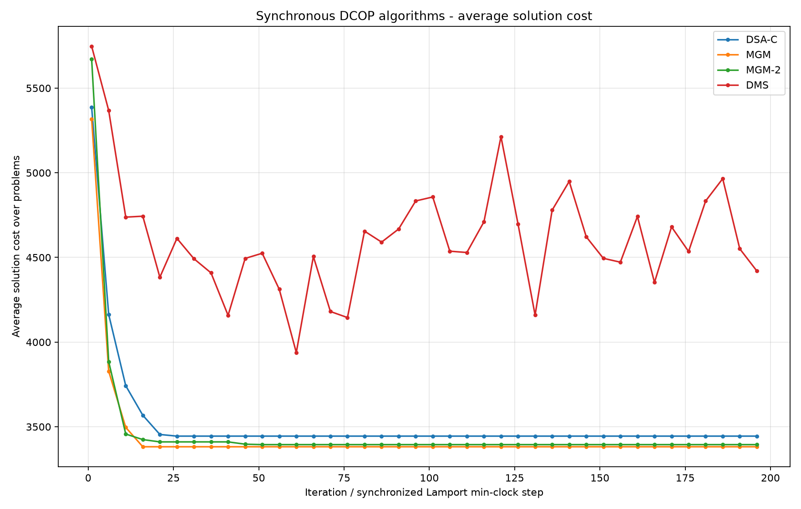
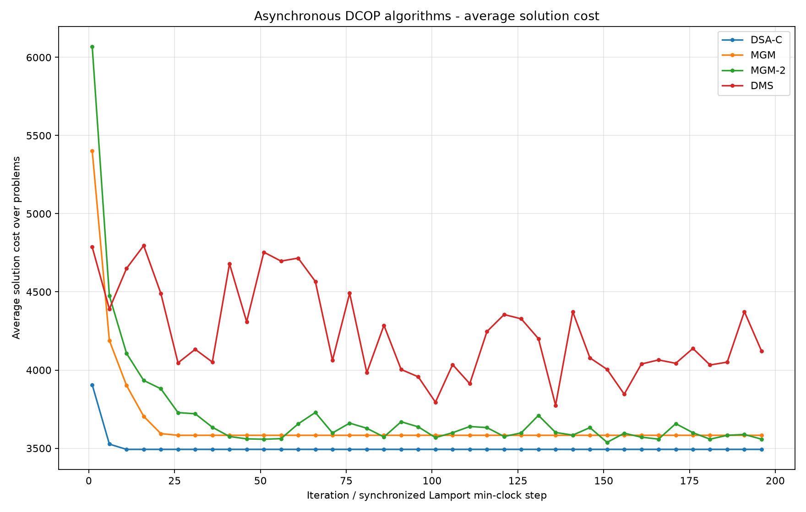

# IIoT Assignment 2 — Distributed Constraint Optimization: A Research Analysis

This repository implements and compares four **incomplete distributed algorithms**
for solving randomly generated **Distributed Constraint Optimization Problems
(DCOPs)**, under both a **synchronous** and an **asynchronous** execution model.

This document is a self-contained research write-up: it defines the problem,
explains *how and why* each algorithm works, presents the experimental results as
graphs, analyses each graph, and explains *why we see the behaviour we see*.

> **TL;DR.** The three *local-search* algorithms (DSA‑C, MGM, MGM‑2) converge
> within ~20 iterations to a good local optimum (≈ 44–46 % cost reduction). The
> *inference* algorithm (DMS / damped min‑sum) does worse and oscillates (≈ 25–32 %)
> because the random DCOP factor graphs are densely cyclic, where belief
> propagation has no convergence guarantee. On identical instances our backend
> matches the reference implementation exactly (MGM and DMS bit‑for‑bit; DSA‑C and
> MGM‑2 within stochastic noise).

---

## 1. The DCOP problem

A **DCOP** is defined by:

- A set of **agents** `0..N-1`, each owning exactly one **variable**.
- A finite **domain** `{0, 1, …, D-1}` of values each variable can take.
- A set of **binary constraints**. A constraint between agents *i* and *j* is a
  `D×D` integer **cost matrix** `C_ij`, where `C_ij[a][b]` is the cost incurred
  when agent *i* picks value *a* and agent *j* picks value *b*.

The **global cost** of an assignment is the sum of the costs of every constraint,
counted once per edge:

```
cost(assignment) = Σ over edges (i,j)  C_ij[ assignment[i] ][ assignment[j] ]
```

The goal is to **minimise** the global cost. **Lower is better.**

### A tiny worked example

Two agents `A`, `B`, domain `{0,1}`, one constraint:

```
          B=0   B=1
   A=0  [   5  ,  2  ]
   A=1  [   8  ,  1  ]
```

- Assignment `A=0, B=0` → cost `5`.
- Assignment `A=0, B=1` → cost `2`.
- Assignment `A=1, B=1` → cost `1`  ← optimal here.

With one binary constraint this is trivial; with 30+ agents and a dense web of
conflicting constraints, finding the global optimum is **NP‑hard**, which is why
we use *incomplete* algorithms that find good solutions quickly rather than
provably optimal ones.

---

## 2. Experimental setup

Problems are generated randomly and reproducibly (`backend/dcop/generator.py`):
an Erdős–Rényi graph where each pair of agents shares a constraint with
probability `p`, and every constraint gets a random `D×D` cost matrix with entries
in `[1, max_cost]`. The same generated problems (and the same initial assignment)
are reused across all algorithms and both simulators, so comparisons are fair.

The graphs in this report come from the `test_1` experiment:

| Parameter | Value |
|---|---|
| Problems (averaged) | 5 |
| Agents | 30 |
| Domain size | 10 |
| Constraint probability `p` | 0.30 (≈ 130 edges, mean degree ≈ 9) |
| Constraint cost range | 1 – 100 |
| Iterations / async steps | 200 |
| DSA‑C move probability | 0.70 |
| DMS damping λ | 0.90 |

Each curve is the **average global cost over the 5 problems** at each iteration.

---

## 3. The four algorithms

### 3.1 DSA‑C — Distributed Stochastic Algorithm (variant C)

**How it works.** Every iteration, *all* agents act simultaneously. Each agent
looks at its neighbours' latest values, computes the value that minimises its own
local cost, and — **with probability `p = 0.70`** — switches to it. Variant **C**
accepts a move when the new local cost is *less than or equal* to the current one
(it allows equal‑cost "plateau" moves), which distinguishes it from variant A
(strict improvement only).

**Why it works.** It is parallel randomised hill‑climbing. The probability `p` is
the crucial ingredient: if every agent always moved greedily and simultaneously,
two neighbours would react to each other's *stale* values and overshoot, causing
oscillation. Moving only with probability `p` decorrelates neighbours and lets the
system settle. Equal‑cost moves let it drift across plateaus and escape shallow
traps.

**What to expect.** A fast drop to a local optimum, then a flat plateau. Cheap per
iteration; only value messages are exchanged.

### 3.2 MGM — Maximum Gain Messages

**How it works.** Two phases per iteration. (1) Each agent computes its **gain**
(how much it could reduce its local cost by moving) and sends it to its
neighbours. (2) An agent actually moves **only if its gain is strictly the largest
in its neighbourhood** (ties broken by lower agent id).

**Why it works.** Because two neighbours can never move in the same round, the
global cost is **monotonically non‑increasing** — MGM never thrashes. It provably
converges to a **1‑opt local optimum** (no single agent can improve). It is
deterministic and extremely communication‑light.

**What to expect.** A smooth, monotone descent to a plateau, often reached in very
few iterations, with the **fewest messages** of any algorithm.

### 3.3 MGM‑2 — coordinated pair moves

**How it works.** Extends MGM with **2‑opt** moves. With probability 0.5 an agent
*offers* to a random neighbour; the receiver evaluates the best *joint* move for
the pair and accepts/rejects (propose → accept/reject handshake). Pairs and
unpaired singletons then compete by gain (ties broken by the lower group leader),
and the locally‑dominant improving groups commit together.

**Why it works.** Some local optima trap any single‑agent (1‑opt) algorithm: no
agent can improve alone, but a *pair* changing together can. By coordinating pair
moves, MGM‑2 escapes a class of optima that MGM and DSA‑C cannot, so it can reach
a lower cost — at the price of much heavier communication (the handshake).

**What to expect.** Fast descent like MGM, frequently to a slightly **lower
plateau**, but with the **most messages** of all four algorithms.

### 3.4 DMS — Max‑Sum with damping (implemented as Min‑Sum)

**How it works.** A belief‑propagation / inference method on the **factor graph**
(variable nodes + one factor node per constraint). Two message types flow along
each edge: variable→factor (`Q`) and factor→variable (`R`). Messages are vectors
over the domain; `R` is computed by minimising the constraint cost plus the
incoming `Q` (min‑sum). **Damping** (`λ = 0.9`) blends each new message with the
previous one to suppress oscillation. Each agent forms a **belief** = sum of
incoming `R` messages and picks the value with minimum belief.

**Why it works — and why it struggles here.** On a **tree‑structured** factor
graph, max‑sum computes the exact optimum. But random DCOPs at `p = 0.30` are
**densely cyclic ("loopy")**, and on loopy graphs min‑/max‑sum has **no
convergence guarantee**: messages circulate around cycles, beliefs oscillate, and
the decoded assignment keeps changing. Damping reduces but does not eliminate
this. The result is a **noisy cost curve that plateaus higher** than local search.

**What to expect.** A jagged, oscillating curve sitting well above the
local‑search trio.

---

## 4. The two simulators

**Synchronous** (`backend/simulators/synchronous.py`). Global rounds with
barriers: every agent reads a consistent snapshot, all act, the round advances.
Deterministic for a given seed → smooth, repeatable curves. The x‑axis is the
iteration number.

**Asynchronous** (`backend/simulators/asynchronous.py`). One **thread + mailbox
per agent**; each agent owns its state and acts whenever it has received at least
one message, using the **latest** message from every neighbour (an `agent_view`).
There is no global clock, so progress is measured by a **Lamport‑style minimum
local step** across all agents, and a run stops when the slowest agent reaches the
step limit. Because thread scheduling is non‑deterministic, async curves are
**noisier** than sync, even though final quality is comparable.

---

## 5. Results — synchronous

<table>
<tr>
<td><b>Our backend</b></td><td><b>Reference example</b></td>
</tr>
<tr>
<td></td>
<td></td>
</tr>
</table>

**What the graphs show.** In both implementations the three local‑search
algorithms (blue = DSA‑C, orange = MGM, green = MGM‑2) collapse from the initial
cost to ≈ 3400–3700 within ~15–25 iterations and then flatten. DMS (red) drops
less and **oscillates** between ~4400 and ~5500 for the whole run.

**Average results over the 5 problems (synchronous):**

| algorithm | backend final | backend drop | example final | example drop |
|---|--:|--:|--:|--:|
| dsa‑c | 3607 | 44.8 % | 3445 | 43.9 % |
| mgm   | 3712 | 43.2 % | 3382 | 44.9 % |
| mgm2  | 3513 | 46.3 % | 3395 | 44.7 % |
| dms   | 4446 | 32.0 % | 4394 | 28.4 % |

**Why we see this.**

- **Local search wins on these instances.** DSA‑C / MGM / MGM‑2 exploit locality
  and reach a good 1‑opt/2‑opt optimum fast. MGM‑2 typically reaches the lowest
  plateau because its pair moves escape optima the others cannot.
- **MGM is the smoothest** (monotone, by construction) and converges in a handful
  of iterations — in the reference run it had *converged on all 5 problems* and
  used by far the fewest messages (~6.5k vs ~51k for DSA‑C and ~153k for MGM‑2).
  This is the classic MGM trade‑off: cheap communication and stability, at the
  cost of getting stuck at the first 1‑opt optimum.
- **DMS oscillates and plateaus high** — the loopy‑graph behaviour described in
  §3.4. Its curve never settles because the underlying beliefs never settle.

---

## 6. Results — asynchronous

<table>
<tr>
<td><b>Our backend</b></td><td><b>Reference example</b></td>
</tr>
<tr>
<td></td>
<td></td>
</tr>
</table>

**Average results over the 5 problems (asynchronous):**

| algorithm | backend final | backend drop | example final | example drop |
|---|--:|--:|--:|--:|
| dsa‑c | 3635 | 44.4 % | 3493 | 43.1 % |
| mgm   | 3775 | 42.3 % | 3583 | 41.7 % |
| mgm2  | 3597 | 45.0 % | 3592 | 41.5 % |
| dms   | 4629 | 29.2 % | 4128 | 32.8 % |

**Why we see this.** The qualitative picture is the same as the synchronous case —
local search converges fast and low, DMS oscillates high — confirming the
behaviour is a property of the *algorithms*, not the execution model. The async
curves are **visibly jaggier**, because each agent acts on whatever messages have
arrived so far (not a clean global snapshot) and thread timing varies run to run.
DMS is the noisiest of all, since its inherent oscillation compounds with
scheduling noise; its "final" value is essentially wherever the oscillation
happened to be at the last step, so small differences there are noise rather than
signal.

> **Engineering note.** Reaching this required rewriting the async simulator to a
> true per‑agent‑thread design (each agent owns its state; no global lock). An
> earlier event‑driven design that re‑decided on *every* message made local search
> thrash to a much worse solution (~15 % drop) and could livelock MGM‑2. See the
> commit history for details.

---

## 7. Why DMS underperforms (the key insight)

It is tempting to read the graphs as "DMS is a worse algorithm," but the precise
statement is: **min‑sum is exact on trees and unreliable on dense cyclic graphs.**
Our random DCOPs at `p = 0.30` have ~130 edges over 30 nodes — far from a tree,
full of short cycles. Messages propagate around those cycles and reinforce
themselves, so beliefs oscillate instead of fixing a consistent optimum. Damping
(`λ = 0.9`) is exactly the standard remedy for this, and it *helps* (without it the
oscillation is worse), but it cannot make a loopy graph behave like a tree. Local
search has no such dependence on graph structure — it just keeps making locally
improving moves — which is why it dominates on this problem class.

---

## 8. Backend vs reference example — a fair comparison

A naive side‑by‑side of §5/§6 suggests the example "wins": its curves sit lower.
**This is an artifact, not an algorithmic difference.** The two codebases use
**different random number generators**, so they solve **different problem sets**:

| | backend | example |
|---|--:|--:|
| mean **initial** cost | 6540 | 6140 |

The example's instances simply start ~400 cheaper, so its curves sit lower
*everywhere*, including at the end. The fair metric — **percentage cost
reduction** — is essentially equal (see the tables above).

To remove the confound entirely, we ran **both implementations on identical
instances** (backend‑generated problems converted into the example's
representation) and overlaid the curves:

<table>
<tr><td><b>Synchronous, identical instances</b></td></tr>
<tr><td></td></tr>
</table>

The colored (backend) and black‑dashed (example) curves lie on top of each other:

| algorithm | backend drop | example drop | note |
|---|--:|--:|---|
| dsa‑c | 46.8 % | 46.0 % | within noise (backend slightly better) |
| mgm   | 44.0 % | 44.0 % | **identical** (MGM is deterministic) |
| mgm2  | 46.1 % | 47.8 % | within stochastic noise |
| dms   | 25.5 % | 25.5 % | **identical** |

<table>
<tr><td><b>Asynchronous, identical instances</b></td></tr>
<tr><td></td></tr>
</table>

In the asynchronous case the curves again occupy the same band; remaining
differences are thread‑scheduling / stochastic noise (the backend is even ahead on
DSA‑C and MGM‑2). **Conclusion: on equal footing the two implementations are
equivalent.**

---

## 9. Summary

- **Algorithm ranking on dense random DCOPs:** MGM‑2 ≈ DSA‑C ≈ MGM (≈ 44–46 %
  reduction) ≫ DMS (≈ 25–32 %, oscillating).
- **MGM** is the cheapest and smoothest but the most easily trapped; **MGM‑2**
  reaches the lowest cost but is the most communication‑hungry; **DSA‑C** is a
  good cheap middle ground.
- **DMS** is the wrong tool for densely‑cyclic instances — its theory only
  guarantees optimality on trees.
- **Synchronous vs asynchronous** make little difference to final quality; async
  is just noisier.
- **Our backend is validated**: on identical instances it matches the reference
  implementation (MGM and DMS exactly; DSA‑C/MGM‑2 within noise).

---

## 10. Reproducing the experiments

Default full experiment (50 problems, 50 agents, 1000 iterations):

```bash
python main.py
```

Smaller run matching this report (`test_1`):

```bash
python main.py --mode full --problems 5 --agents 30 --iterations 200 \
  --algorithms dsa-c,mgm,mgm2,dms --simulators sync,async \
  --output-dir tests/test_1/backend
```

Useful flags: `--constraint-probability`, `--seed`, `--no-progress`, `--no-plots`,
`--output-dir`. Outputs are average‑cost CSVs and the PNG graphs shown above.

> Note: a full 50/50/1000 run currently takes ~7.4 h, dominated by the
> (pure‑Python) synchronous DMS; vectorising it with numpy would bring it to
> ~1.5 h.

### Project layout

```
backend/
  dcop/         problem model, random generator, cost evaluation
  algorithms/   dsa_c.py, mgm.py, mgm2.py, dms.py (+ base.py)
  simulators/   synchronous.py, asynchronous.py
  experiments/  runner.py, results.py, plotting.py, progress.py
report/figures/ graphs used in this analysis
main.py         CLI entry point
```
